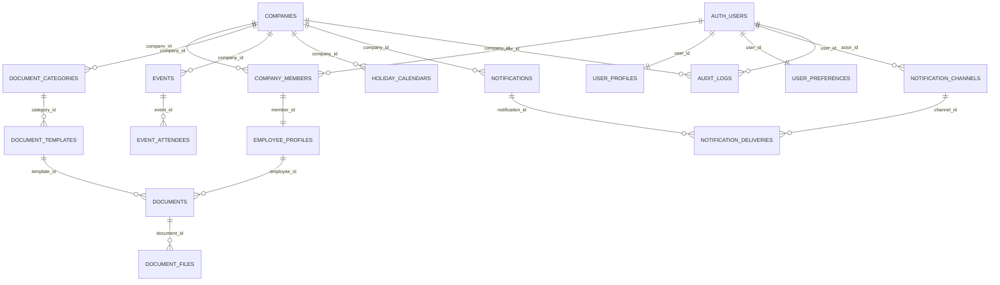

# Workfolio API Documentation

This directory consolidates backend planning artifacts for the Supabase stack. Start with the high-level goals in `../API.md`, then dive into schema-specific guides stored in dedicated folders here.

## Structure
- `schemas/` – folder with one subdirectory per domain schema.
  - `company/COMPANY.md` – tenant master data, plan tiers, and audit governance.
  - `user/USER.md` – user identity, membership, security, and preferences.
  - `documents/DOCUMENTS.md` – document categories, templates, issues, and file versions.
  - `notifications/NOTIFICATIONS.md` – delivery channels, notification queue, and delivery logs.
  - `events/EVENTS.md` – calendar events, attendees, and holiday cache.

## Schema Connectivity

## Contributing
1. Create a folder under `schemas/` matching the domain name (kebab-case). Inside, add a `<SCHEMA>.md` file (uppercase, e.g., `PAYROLL.md`) with table definitions, relationships, RLS guidance, lifecycle notes, and a Mermaid diagram.
2. Link back to relevant rules in `rules/` (e.g., `code-style`, `security`, `analytics-logging`) so policies stay front of mind.
3. Keep doc updates in sync with Supabase migrations to avoid drift.
4. Apply schema changes using `yarn db:setup` (set `SUPABASE_DB_URL`, `EXPO_PUBLIC_SUPABASE_URL_DB`, or `EXPO_PUBLIC_SUPABASE_URL_SQL` with the Database connection string from Supabase Settings → Database) so documentation and database stay aligned.

> Tip: Use `yarn lint` before submitting PRs to ensure markdown linting conventions remain consistent.
