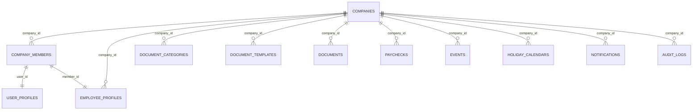

# Company Domain Schema

Centralizes tenant records, membership, and cross-domain governance for Workfolio. These tables enforce multi-tenant boundaries and seed downstream entities (documents, events, payroll, notifications).

## Scope
- Represents each customer company with billing, configuration, and lifecycle metadata.
- Manages user membership, roles, and invite status via `company_members`.
- Feeds audit/compliance logs and references for dependent domains (documents, events, payroll, notifications).

## Relationship Diagram

## Table Overview
| Table | Purpose | Notes |
| --- | --- | --- |
| `companies` | Canonical tenant record with plan, locale, and billing metadata. | Drives RLS boundaries for all domain tables. |
| `company_members` | Associates Supabase users with a company and role. | Detailed definition lives in `schemas/user/USER.md`; summarized here for tenant context. |
| `audit_logs` | Compliance trail for company-level actions. | Shared domain; entries filtered by `company_id`. |

## Table Definitions

### `companies`
- **Columns**
  - `id uuid primary key default uuid_generate_v4()`
  - `name text not null`
  - `legal_name text`
  - `company_code text not null unique`
  - `country_code text not null` *(ISO 3166-1 alpha-2)*
  - `default_time_zone text not null default 'UTC'`
  - `plan_tier text not null default 'trial' check (plan_tier in ('trial','starter','growth','enterprise'))`
  - `plan_renewal_at timestamptz`
  - `billing_email text`
  - `industry text`
  - `employee_count_estimate integer`
  - `logo_url text`
  - `created_by uuid references auth.users(id)`
  - `created_at timestamptz default now()`
  - `updated_at timestamptz default now()`
  - `deactivated_at timestamptz`
  - `metadata jsonb` *(arbitrary per-tenant settings)*
- **Indexes**
  - Unique on `company_code`.
  - `idx_companies_plan_tier` on (`plan_tier`).
  - `idx_companies_country` on (`country_code`).
- **Relationships**
  - `company_members`, `documents`, `events`, `notifications`, `paychecks`, etc. reference `companies.id`.
  - `created_by` links back to founding admin (`auth.users`).
- **RLS Policies**
  - Allow `select` for users with membership in the company via `company_members` join.
  - Allow `update`/`delete` only for admins (`role = 'admin'`) within tenant.
  - Service role can insert for onboarding Edge Function.
- **Lifecycle**
  - Created through `rpc_create_company` (see API.md) when admin completes signup.
  - Plan upgrades adjust `plan_tier` and `metadata` fields; triggers should append entries to `audit_logs`.
  - Deactivation sets `deactivated_at`, soft-disabling memberships and dependent data via RLS.

### `company_members`
Refer to `../user/USER.md` for full column breakdown. Key tenant responsibilities:
- Enforce unique (`company_id`, `user_id`) membership.
- Drive RLS conditions for every company-scoped table.
- Provide role-based access (`admin`, `employee`) and status transitions (`invited`, `active`, `suspended`, `left`).
- Trigger dependent provisioning: on activation, create `employee_profiles` (employees) and `user_preferences` defaults.

### `audit_logs`
- **Columns**
  - `id uuid primary key default uuid_generate_v4()`
  - `company_id uuid not null references companies(id)`
  - `actor_id uuid references auth.users(id)`
  - `action text not null`
  - `severity text not null default 'info'`
  - `metadata jsonb`
  - `created_at timestamptz default now()`
- **Indexes**
  - `idx_audit_logs_company_time` on (`company_id`, `created_at desc`).
  - Optional GIN on `metadata` for analytics.
- **RLS Policies**
  - Members can read logs for their company (scope by `company_id`).
  - Insert restricted to service role or trusted RPCs (e.g., executed via Edge Functions).
- **Lifecycle**
  - Inserted through triggers on key tables (memberships, plans, documents, etc.) to maintain compliance trail.

## Compliance & Governance Notes
- All tenant-scoped tables must include `company_id` and rely on RLS policies derived from `company_members`.
- Plan tier upgrades may unlock features; store entitlements in `metadata` keyed by feature name (e.g., `{ "documents.max_templates": 25 }`).
- Deleting a company should be soft only; Archive records, revoke access, and queue storage cleanup asynchronously to honour retention policies.

## Outstanding Work
- Model `subscriptions` and billing linkage once pricing strategy is finalized.
- Define automation rules for cascading deactivation (e.g., disable notifications, cancel events) when `deactivated_at` is set.
- Document support workflows for changing `company_code` safely across references.
