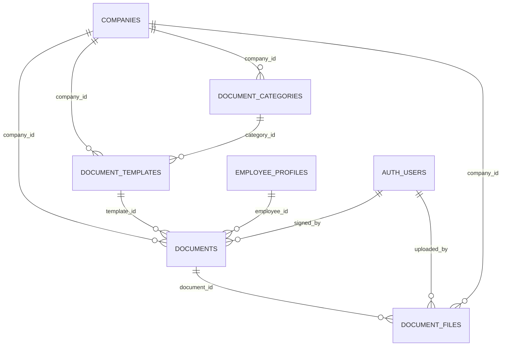

# Documents Domain Schema

Models the lifecycle of HR documents from template authoring through employee acknowledgment. Aligns with the documentation strategy outlined in `API.md`.

## Scope
- Categorizes documents per company and seeds reusable templates.
- Tracks issued documents per employee, signatures, and deadlines.
- Links uploaded files and version history stored in Supabase Storage.

## Relationship Diagram

## Table Overview
| Table | Purpose | Notes |
| --- | --- | --- |
| `document_categories` | Admin-defined taxonomy for grouping documents. | Scoped per company; enables filtering in UI. |
| `document_templates` | Reusable templates seeded by admins. | Drives issued documents; can be published/unpublished. |
| `documents` | Instances assigned to employees. | Tracks status, signature state, due dates. |
| `document_files` | Versioned file storage references. | Supports template source files and signed uploads. |

## Table Definitions

### `document_categories`
- **Columns**
  - `id uuid primary key default uuid_generate_v4()`
  - `company_id uuid not null references companies(id)`
  - `name text not null`
  - `description text`
  - `is_active boolean not null default true`
  - `created_by uuid references auth.users(id)`
  - `created_at timestamptz default now()`
  - `updated_at timestamptz default now()`
- **Indexes**
  - Unique (`company_id`, `name`).
  - `idx_document_categories_active` on (`company_id`, `is_active`).
- **RLS Policies**
  - Admins (`company_members.role = 'admin'`) manage categories within their company.
  - Employees receive `select` access for active categories via tenant join.

### `document_templates`
- **Columns**
  - `id uuid primary key default uuid_generate_v4()`
  - `company_id uuid not null references companies(id)`
  - `category_id uuid references document_categories(id)`
  - `title text not null`
  - `description text`
  - `requires_signature boolean not null default true`
  - `is_published boolean not null default false`
  - `valid_from date`
  - `valid_until date`
  - `default_due_days integer` *(days after issue to set `due_at`)*
  - `version integer not null default 1`
  - `last_published_at timestamptz`
  - `created_by uuid references auth.users(id)`
  - `updated_by uuid references auth.users(id)`
  - `created_at timestamptz default now()`
  - `updated_at timestamptz default now()`
- **Indexes**
  - `idx_document_templates_company_status` on (`company_id`, `is_published`).
  - `idx_document_templates_category` on (`category_id`).
- **Lifecycle Notes**
  - Draft templates remain `is_published = false` until reviewed.
  - Publishing increments `version` and stamps `last_published_at`.
  - Superseded templates remain for audit; new issues reference the current `version`.

### `documents`
- **Columns**
  - `id uuid primary key default uuid_generate_v4()`
  - `company_id uuid not null references companies(id)`
  - `template_id uuid references document_templates(id)`
  - `employee_id uuid not null references employee_profiles(id)`
  - `title text not null`
  - `status text not null default 'pending' check (status in ('pending','signed','rejected','expired'))`
  - `issued_at timestamptz default now()`
  - `due_at timestamptz`
  - `signed_at timestamptz`
  - `signed_by uuid references auth.users(id)`
  - `rejected_at timestamptz`
  - `rejected_reason text`
  - `expired_at timestamptz`
  - `metadata jsonb`
  - `created_by uuid references auth.users(id)`
  - `updated_at timestamptz default now()`
- **Indexes**
  - `idx_documents_employee_status` on (`employee_id`, `status`).
  - `idx_documents_company_due` on (`company_id`, `due_at`).
- **RLS Policies**
  - Employees can `select` documents where `employee_id` maps back to their membership.
  - Admins can manage documents within their company.
  - Inserts limited to admins/service roles (issue automation).
- **Lifecycle Notes**
  - Follow lifecycle `draft → issued → pending → signed/rejected/expired` per API guidance.
  - Status transitions trigger `audit_logs` entries and `notifications` fan-out.
  - `metadata` reserved for e-sign provider payloads or acknowledgments.

### `document_files`
- **Columns**
  - `id uuid primary key default uuid_generate_v4()`
  - `company_id uuid not null references companies(id)`
  - `document_id uuid references documents(id)`
  - `template_id uuid references document_templates(id)` *(optional linkage for template source)*
  - `file_path text not null`
  - `file_size integer`
  - `content_type text`
  - `version integer not null default 1`
  - `uploaded_by uuid references auth.users(id)`
  - `uploaded_at timestamptz default now()`
  - `checksum text` *(integrity verification)*
- **Indexes**
  - `idx_document_files_document_version` on (`document_id`, `version` desc).
  - `idx_document_files_template` on (`template_id`).
- **Lifecycle Notes**
  - File path pattern: `company/{company_id}/documents/{document_id or template_id}/{version}` per API.md.
  - Maintain version history; never delete signed documents (compliance).
  - Metadata can track signed URL expiry or provider references if needed.

## RLS & Compliance Considerations
- Enforce tenant isolation using `company_id` filters resolved via `company_members`/`employee_profiles` joins.
- Mask sensitive data in employee view (e.g., hide `rejected_reason`) using Postgres views or column-level policies if required.
- Trigger `audit_logs` on template publishes, document issues, and signature outcomes.

## Outstanding Work
- Define automation for seeding default templates during company onboarding.
- Determine whether countersignature workflows are needed (e.g., manager sign-off) and extend schema accordingly.
- Evaluate storing OCR/parsed data for search; would require additional tables or search indexes.
