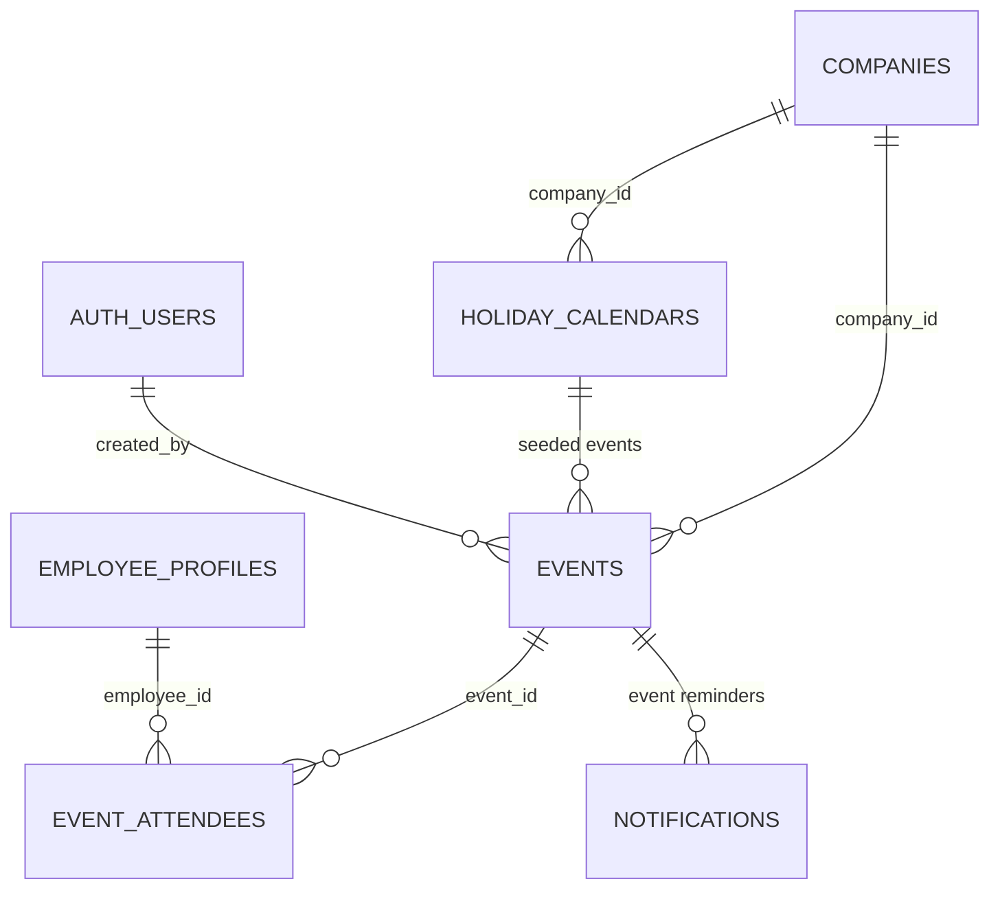

# Events Domain Schema

Captures company calendars, targeted attendees, and holiday caching to power Workfolio's scheduling features.

## Scope
- Stores company-wide and targeted events with metadata for reminders.
- Manages optional attendee lists when events are not organization-wide.
- Caches holidays per company/country for auto-generated events.

## Relationship Diagram

## Table Overview
| Table | Purpose | Notes |
| --- | --- | --- |
| `events` | Master record for company events. | Supports types (`company`, `birthday`, `holiday`, `hr_event`). |
| `event_attendees` | Optional attendee targeting. | Rows exist only when event is limited. |
| `holiday_calendars` | Cached holidays for auto events. | Seeded per company/country. |

## Table Definitions

### `events`
- **Columns**
  - `id uuid primary key default uuid_generate_v4()`
  - `company_id uuid not null references companies(id)`
  - `type text not null check (type in ('company','birthday','holiday','hr_event'))`
  - `title text not null`
  - `description text`
  - `start_at timestamptz not null`
  - `end_at timestamptz`
  - `is_all_day boolean not null default false`
  - `source text not null default 'manual' check (source in ('manual','generated','imported'))`
  - `location text`
  - `created_by uuid references auth.users(id)`
  - `updated_by uuid references auth.users(id)`
  - `created_at timestamptz default now()`
  - `updated_at timestamptz default now()`
  - `cancelled_at timestamptz`
  - `metadata jsonb` *(ICS IDs, external links, etc.)*
- **Indexes**
  - `idx_events_company_start` on (`company_id`, `start_at`).
  - `idx_events_type` on (`company_id`, `type`).
  - Partial index on `cancelled_at is null` for active events.
- **Lifecycle Notes**
  - Auto-generated birthdays originate from `employee_profiles.birthday` via scheduled job.
  - Holiday events seeded from `holiday_calendars` and can be overridden (set `cancelled_at`).
  - Reminder notifications scheduled 24h prior through Edge Function; references stored in `notifications`.

### `event_attendees`
- **Columns**
  - `id uuid primary key default uuid_generate_v4()`
  - `event_id uuid not null references events(id) on delete cascade`
  - `employee_id uuid not null references employee_profiles(id)`
  - `response_status text not null default 'pending' check (response_status in ('pending','accepted','declined'))`
  - `notified_at timestamptz`
  - `response_at timestamptz`
  - `metadata jsonb`
- **Indexes**
  - Unique (`event_id`, `employee_id`).
  - `idx_event_attendees_employee` on (`employee_id`).
- **Lifecycle Notes**
  - Rows created only when event is not company-wide; absence implies full-company event.
  - Response updates drive analytics and optional follow-up notifications.
  - `notified_at` timestamps when initial reminder is sent.

### `holiday_calendars`
- **Columns**
  - `id uuid primary key default uuid_generate_v4()`
  - `company_id uuid not null references companies(id)`
  - `country_code text not null`
  - `name text not null`
  - `date date not null`
  - `source text not null` *(e.g., 'workable_api', 'manual')*
  - `is_observed boolean not null default true`
  - `created_at timestamptz default now()`
  - `updated_at timestamptz default now()`
- **Indexes**
  - `idx_holiday_calendars_company_date` on (`company_id`, `date`).
  - `idx_holiday_calendars_country` on (`country_code`, `date`).
- **Lifecycle Notes**
  - Refreshed periodically via Edge Function syncing from external holiday provider.
  - Admin overrides (disable/rename) update the record and propagate to upcoming events.

## RLS & Compliance Considerations
- `events`: allow `select` for all members within tenant; `update/delete` restricted to admins (`role = 'admin'`) or creator for manual events.
- `event_attendees`: employees can view attendance rows where they are the attendee; admins can manage all rows.
- `holiday_calendars`: read-only for employees; admins/service roles can modify.
- Related notifications should reference `company_id` to maintain tenant isolation in delivery workers.

## Outstanding Work
- Define ICS export/table for integration with external calendars when feature is prioritized.
- Determine retention policy for past events and attendance data (e.g., purge after 2 years).
- Expand schema if team-based targeting (`teams` table) becomes available; will introduce additional join table.
