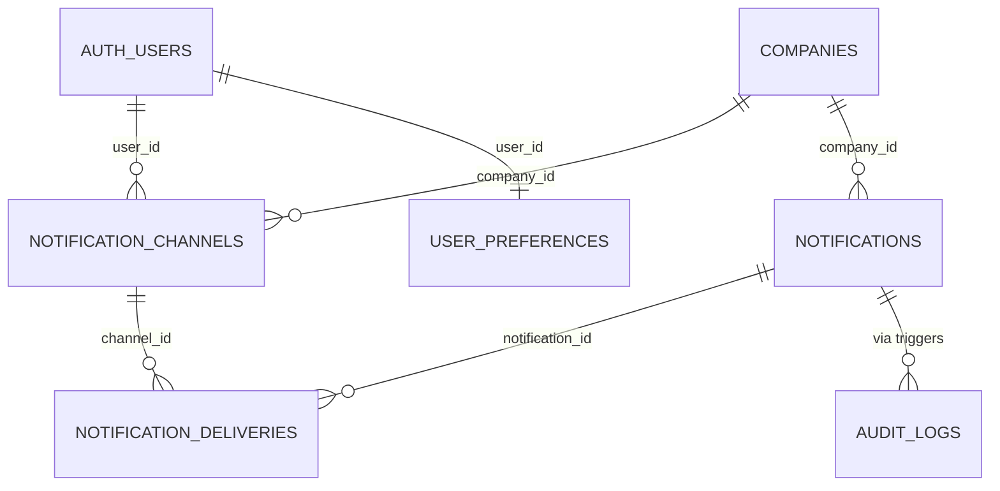

# Notifications Domain Schema

Defines how Workfolio records delivery endpoints, queues outbound messages, and audits delivery attempts.

## Scope
- Registers user-level channels (push tokens, emails) with verification state.
- Queues notifications produced by business events (documents, paychecks, events).
- Logs per-channel delivery attempts for audit, retries, and analytics.

## Relationship Diagram

## Table Overview
| Table | Purpose | Notes |
| --- | --- | --- |
| `notification_channels` | Stores user delivery endpoints (push/email). | Supports verification and last-seen timestamps. |
| `notifications` | Enqueued notification payloads. | Categorized by source and priority. |
| `notification_deliveries` | Delivery outcomes per channel. | Tracks status, timestamps, failure reasons. |

## Table Definitions

### `notification_channels`
- **Columns**
  - `id uuid primary key default uuid_generate_v4()`
  - `company_id uuid references companies(id)` *(null for global channels such as personal email)*
  - `user_id uuid not null references auth.users(id)`
  - `type text not null check (type in ('push','email'))`
  - `target text not null` *(Expo token, email address)*
  - `is_verified boolean not null default false`
  - `verification_code text`
  - `verification_expires_at timestamptz`
  - `last_seen_at timestamptz`
  - `device_info jsonb`
  - `created_at timestamptz default now()`
  - `updated_at timestamptz default now()`
- **Indexes**
  - Unique on (`type`, `target`) to avoid duplicates.
  - `idx_notification_channels_user_type` on (`user_id`, `type`).
  - Optional partial index where `is_verified = true` for routing.
- **Lifecycle Notes**
  - Created by client when registering device/email; unverified channels require confirmation flow.
  - `last_seen_at` updated when a delivery succeeds using that channel.
  - Stale channels (no activity for N days) can be pruned by scheduled job.

### `notifications`
- **Columns**
  - `id uuid primary key default uuid_generate_v4()`
  - `company_id uuid references companies(id)`
  - `category text not null` *(e.g., 'document', 'payroll', 'event')*
  - `title text not null`
  - `body text`
  - `payload jsonb` *(structured data for clients)*
  - `priority text not null default 'normal' check (priority in ('low','normal','high'))`
  - `target_scope text not null default 'user' check (target_scope in ('user','company','custom'))`
  - `target_user_id uuid references auth.users(id)`
  - `target_employee_id uuid references employee_profiles(id)`
  - `source_reference text` *(document/paycheck/event id string)*
  - `scheduled_at timestamptz`
  - `created_by uuid references auth.users(id)` *(system/service id for automation)*
  - `created_at timestamptz default now()`
- **Indexes**
  - `idx_notifications_company_created` on (`company_id`, `created_at desc`).
  - Partial index on (`target_user_id`) where `target_scope = 'user'`.
- **Lifecycle Notes**
  - Inserted by domain triggers or RPCs (documents issued, paychecks published, event reminders).
  - Edge Function polls for unsent notifications, resolves eligible channels via `notification_channels` + `user_preferences`.
  - Completion triggers creation of `notification_deliveries` per channel.

### `notification_deliveries`
- **Columns**
  - `id uuid primary key default uuid_generate_v4()`
  - `notification_id uuid not null references notifications(id) on delete cascade`
  - `channel_id uuid not null references notification_channels(id)`
  - `status text not null default 'pending' check (status in ('pending','sent','failed','read'))`
  - `sent_at timestamptz`
  - `read_at timestamptz`
  - `fail_reason text`
  - `retry_count integer not null default 0`
  - `metadata jsonb` *(provider response, Expo receipt, etc.)*
  - `created_at timestamptz default now()`
- **Indexes**
  - `idx_notification_deliveries_notification` on (`notification_id`).
  - Partial index on (`status`) where `status = 'failed'` for retry workers.
- **Lifecycle Notes**
  - Worker updates `status`/`sent_at`/`fail_reason` post delivery attempt.
  - Client confirmations (e.g., reading notifications) can update `read_at` through RPC.
  - Retention policy can purge rows after 180 days while preserving summary metrics in analytics views.

## RLS & Compliance Considerations
- `notification_channels`: users manage their own channels; admins can view for company-level debugging if `company_members.role = 'admin'`.
- `notifications`: restrict `select` to recipients (matching user/company) and admins; service role handles inserts.
- `notification_deliveries`: only the owning user (via channel) and admins can view; updates limited to delivery worker/service role.
- All writes should append `audit_logs` entries for critical actions (channel verification, admin overrides).

## Outstanding Work
- Define `notification_preferences` view or join logic that merges `user_preferences` flags with channel availability.
- Implement retention job to archive notifications beyond compliance window.
- Document error-handling expectations for third-party providers (Expo, email) and map to `fail_reason` codes.
