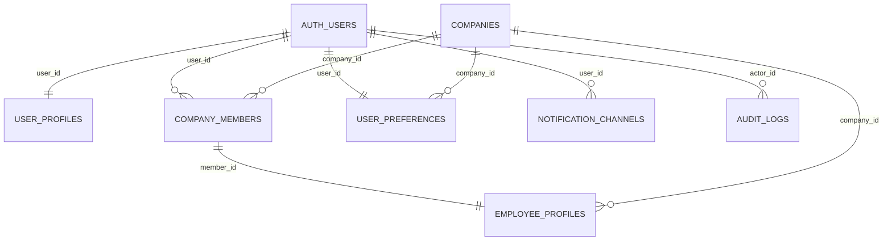

# User Domain Schema

Authoritative reference for Workfolio's user identity, membership, security, and preference tables. Aligns with the backend plan in `API.md` and informs Supabase migration work.

## Scope
- Models every Supabase-authenticated person (admins and employees).
- Tracks tenant membership, HR-specific employment data, and security credentials (PIN, biometrics metadata).
- Centralizes notification targets and user-configurable preferences that power the mobile settings screen.

## Relationship Diagram

## Table Overview
| Table | Purpose | Notes |
| --- | --- | --- |
| `auth.users` | Base Supabase auth identity. | Managed by Supabase; Workfolio stores metadata for roles and onboarding status. |
| `user_profiles` | Extended profile for all users. | Lives 1:1 with `auth.users`; holds display data and localization fields. |
| `company_members` | Links a user to a tenant and role. | Enforces multi-tenant scoping (`company_id`) and account lifecycle. |
| `employee_profiles` | HR-only employee record. | Exists only for members with `role = 'employee'`; contains sensitive employment and PIN info. |
| `user_preferences` *(planned)* | User-configurable settings. | Drives notification opt-ins, theme and biometric prompts. |

## Table Definitions

### `auth.users`
- **Managed Columns**: `id (uuid PK)`, `email`, `phone`, `created_at`, `last_sign_in_at`, `is_anonymous`, `raw_user_meta_data`
- **Workfolio Metadata**
  - `raw_user_meta_data.role` (`'admin' | 'employee'`) mirrors `company_members.role` for quick access.
  - `raw_user_meta_data.invite_context` stores `company_code` used during onboarding.
  - `raw_user_meta_data.settings_version` increments when preference schema changes; used for forced refreshes on the client.
- **Indexes / Constraints**: Supabase-managed unique indexes on `email`, `phone`. No custom indexes required.
- **RLS**: Supabase handles auth RLS; downstream tables enforce tenant isolation. Avoid direct queries where possible—join through `company_members`.

### `user_profiles`
- **Columns**
  - `user_id uuid primary key references auth.users(id)`
  - `full_name text not null`
  - `preferred_name text`
  - `avatar_url text`
  - `phone text`
  - `time_zone text not null default 'UTC'`
  - `locale text not null default 'en'`
  - `bio text`
  - `created_at timestamptz default now()`
  - `updated_at timestamptz default now()`
- **Indexes**
  - `idx_user_profiles_locale` on (`locale`) for localization analytics.
  - `idx_user_profiles_time_zone` on (`time_zone`) to support scheduling queries.
- **Relationships**: One-to-one with `auth.users`; join on `user_id`. `company_members` references `user_profiles` for display names.
- **RLS Policies**
  - `user can view/update own profile`: `user_id = auth.uid()`.
  - `admins can read members`: join via `company_members` where `company_members.role = 'admin'` and `company_id` matches.
- **Lifecycle**: Inserted immediately after Supabase signup (Edge function). Updates via settings screen patch route.

### `company_members`
- **Columns**
  - `id uuid primary key default uuid_generate_v4()`
  - `company_id uuid not null references companies(id)`
  - `user_id uuid not null references auth.users(id)`
  - `role text not null check (role in ('admin','employee'))`
  - `status text not null default 'invited' check (status in ('invited','active','suspended','left'))`
  - `invited_at timestamptz default now()`
  - `joined_at timestamptz`
  - `suspended_at timestamptz`
  - `invited_by uuid references auth.users(id)`
  - `note text`
  - `created_at timestamptz default now()`
- **Indexes / Constraints**
  - Unique (`company_id`, `user_id`).
  - `idx_company_members_company_role` on (`company_id`, `role`).
  - `idx_company_members_status` on (`company_id`, `status`).
- **Relationships**
  - `companies` ←→ `company_members` ←→ `auth.users`.
  - `employee_profiles.member_id` foreign key to `company_members.id` (employee-only rows).
  - Used by RLS across domain tables (`company_id` scoping).
- **RLS Policies**
  - `Members can read peers in same company`: filter by `company_id` via subquery using `auth.uid()`.
  - `Admins manage memberships`: only rows with `role = 'admin'` and same `company_id` can insert/update.
  - `Self` updates limited to status transitions like `left` (future automation).
- **Lifecycle**
  - Created when admin invites or when user self-joins with `company_code`.
  - `status` transitions: `invited` → `active` on acceptance; `suspended` via admin action; `left` when user is deactivated.
  - Deleting membership triggers cascade removal of `employee_profiles` and disables preferences (planned via triggers).

### `employee_profiles`
- **Columns**
  - `id uuid primary key default uuid_generate_v4()`
  - `company_id uuid not null references companies(id)`
  - `member_id uuid not null references company_members(id)`
  - `employee_number text`
  - `job_title text`
  - `department text`
  - `manager_member_id uuid references company_members(id)`
  - `birthday date`
  - `hire_date date`
  - `termination_date date`
  - `is_active boolean not null default true`
  - `pin_hash text` *(bcrypt/argon2 hashed PIN)*
  - `pin_failed_attempts smallint not null default 0`
  - `pin_locked_until timestamptz`
  - `pin_last_reset_at timestamptz`
  - `emergency_contact jsonb`
  - `address jsonb`
  - `created_at timestamptz default now()`
  - `updated_at timestamptz default now()`
- **Indexes**
  - Unique (`company_id`, `employee_number`).
  - `idx_employee_profiles_company_manager` on (`company_id`, `manager_member_id`).
  - `idx_employee_profiles_active` on (`company_id`, `is_active`).
- **Relationships**
  - Tied to `documents`, `paychecks`, `events`, `notification_deliveries`, and other domain tables via `employee_id` (which references `employee_profiles.id`).
  - Manager references enforce org hierarchy.
- **RLS Policies**
  - `Employees view limited self fields`: allow select on own `member_id`, restrict sensitive columns via column-level policies or views.
  - `Admins/HR` (role = `admin`) can select/update within same `company_id`.
  - Write operations constrained to service roles for payroll imports (via Edge Functions with elevated key).
- **Lifecycle**
  - Provisioned when employee accepts invite and completes onboarding forms.
  - Deactivation sets `is_active = false`, stamps `termination_date`, resets PIN data, and triggers audit entry.

### `user_preferences` *(new table proposal)*
- **Purpose**: Persist per-user settings exposed through the mobile settings screen and upcoming web dashboard.
- **Columns**
  - `user_id uuid primary key references auth.users(id)`
  - `company_id uuid references companies(id)` *(nullable for cross-tenant admins)*
  - `theme text not null default 'system' check (theme in ('system','light','dark'))`
  - `language text references i18n_locales(code) default 'en'`
  - `timezone_override text`
  - `receive_company_announcements boolean not null default true`
  - `receive_payroll_notifications boolean not null default true`
  - `receive_document_prompts boolean not null default true`
  - `biometric_auth_enabled boolean not null default false`
  - `pin_required_for_sensitive boolean not null default true`
  - `marketing_opt_in boolean not null default false`
  - `created_at timestamptz default now()`
  - `updated_at timestamptz default now()`
  - `updated_by uuid references auth.users(id)` *(tracks admin overrides)*
- **Indexes**
  - `idx_user_preferences_company` on (`company_id`).
  - `idx_user_preferences_flags` partial indexes on flag columns if analytics needs arise (evaluate during implementation).
- **Relationships**
  - Joins to `notification_channels` to determine valid delivery paths.
  - References `audit_logs` for change tracking (`actor_id` = `updated_by`).
- **RLS Policies**
  - `Self-service`: `auth.uid() = user_id` for select/update.
  - `Admin override`: allow update where `company_members.role = 'admin'` and `company_id` matches, plus log to `audit_logs` via trigger.
- **Lifecycle**
  - Inserted with defaults when membership is activated.
  - Updated via settings screen or admin overrides; each update increments `raw_user_meta_data.settings_version` to notify clients.

## Relationships & Data Flow
1. **Signup**
   - Supabase creates `auth.users` row → Edge function seeds `user_profiles` and provisional `company_members` (status `invited`).
2. **Join Company**
   - User enters `company_code`, membership activated, `user_preferences` defaults inserted, optional `employee_profiles` row created if role `employee`.
3. **Settings Updates**
   - Client writes to `user_profiles`, `user_preferences`; triggers append `audit_logs` entry and sync `settings_version`.
4. **Security Events**
   - PIN/Biometric changes update `employee_profiles` (PIN columns) and create `paycheck_signature_events` records when signing payroll docs.
5. **Notifications**
   - `user_preferences` opt-ins inform `notifications` routing; `notification_channels` and `notification_deliveries` reference the same `user_id`.

## RLS & Compliance Considerations
- All domain tables must enforce tenant isolation via `company_members`. When adding new views or functions, ensure queries resolve `company_id` through a join on `member_id` or `user_id`.
- Sensitive columns (`pin_hash`, address, emergency contact) should be shielded from general employee access. Consider exposing sanitized views for employee self-service while restricting base table selects to service roles and admins.
- Every update to membership, profile, or preferences should invoke `audit_logs` with `actor_id`, `action`, and `metadata` describing old/new values.

## Decisions & Open Items
- **Preference history**: Implement soft-delete snapshots to preserve change history (e.g., archive row before update). Detail migration strategy when building Supabase scripts.
- **Channel overrides**: Not required initially; retain consolidated boolean toggles and revisit if analytics demands finer granularity.
- **Multi-company admins**: Out of scope for now; single preference row per user remains sufficient until cross-tenant admin support is prioritized.

Use this document as the blueprint when creating Supabase migrations, API handlers, and settings UI bindings.
